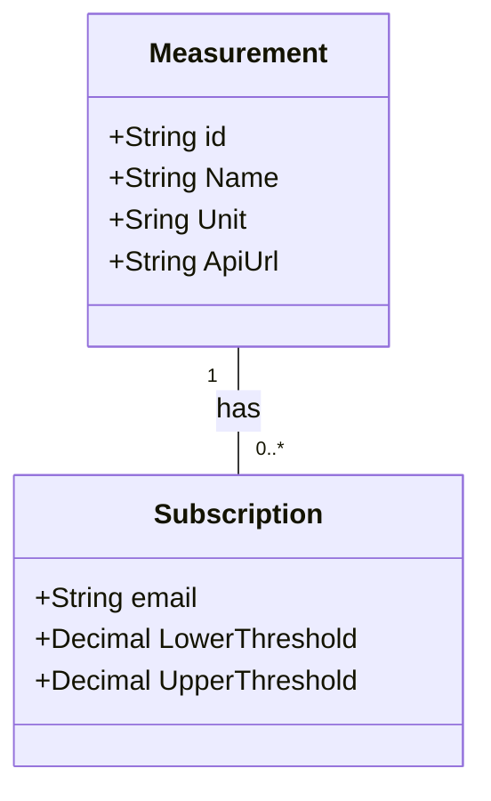

# ThresholdAlerts
A simple ASP.NET Web API example implementing Clean Architecture, using controller technology and services in the application layer.

It uses Entity Framework as the ORM and SQLite as the database.

For authorization and authentication, it is integrated with Azure AD B2C.

## Description
The Web API is designed to register users through an email address to monitor measurements, defining both an upper and lower threshold.

An example of a measurement could be the Bitcoin exchange rate in USD, the USD exchange rate in Argentinian pesos, and so on.

When the Alert process is executed, the system evaluates each measurement, retrieves the updated value from a trusted source, and compares it against the upper and lower thresholds of every measurement subscription. If a threshold is exceeded, an email is sent to the address registered with the subscription.

## Use case: Register a measurement
Preconditions
- The user signed up in the app with their email address.

Basic path
1. The user logs in to the app.
2. The app lists all available measurements.
3. The user selects a measurement.
4. The user sets lower and upper threshold values.
5. The user confirms the suscription.
6. The app creates the suscription for the email associated with the user.
7. When the Alert process is executed, the app fetches an updated value of the measurement and evaluates the thresholds to send an email if one is exceeded.

## Domain model




# Deploy
[Feel free to try the Web API on Azure](https://thresholdalerts-d5cwedg3awhwcuee.eastus-01.azurewebsites.net/swagger) 


# Resources
## Videos
[Crear una solución .NET Web API con arquitectura Clean y subirla a Github](https://youtu.be/-KbphJMaqzs?si=tEEmXpfVvrwaOdcZ)

[Implementar Entity Framework en una solución ASP.NET con arquitectura Clean](https://youtu.be/gt9G0AZVlvI?si=3i0IR1qPLPzk-UYO)

[CI/CD de una NET Web API en Azure con Github actions.](https://youtu.be/9s2GDa4Uj1k?si=2grLUnSkHu-fC1F4)

[Azure B2C en una ASP NET Web API integrado con Swagger](https://youtu.be/sJQ3kBZfFPc?si=bS6qqo8dNSqJcoig)

## Projects creation
```
dotnet new sln -n "ThresholdAlerts"
mkdir src
cd src
dotnet new webapi -f net8.0 -controllers -n Web
dotnet new classlib -f net8.0 -n "Core"
dotnet new classlib -f net8.0 -n "Infrastructure"
cd ..
dotnet sln ThresholdAlerts.sln add src/**/*.csproj
dotnet add src/Web/Web.csproj reference src/Infrastructure/Infrastructure.csproj
dotnet add src/Web/Web.csproj reference src/Core/Core.csproj
dotnet add src/Infrastructure/Infrastructure.csproj reference src/Core/Core.csproj
```

## Entity framework config
### Install
```
dotnet tool update --global dotnet-ef
```
src/Infractructure
```
dotnet add package Microsoft.EntityFrameworkCore.Sqlite
dotnet add package Microsoft.EntityFrameworkCore.Design
```
Update Infrastructure.csproj
```
<PrivateAssets>All</PrivateAssets> --> <PrivateAssets></PrivateAssets>
For
PackageReference Include="Microsoft.EntityFrameworkCore.Design" Version="8.0.8
```


### Create migrations
```
dotnet ef migrations add InitialMigration --context ApplicationDbContext --startup-project src/Web --project src/Infrastructure -o Data/Migrations
```
### update database
```
dotnet ef database update --context ApplicationDbContext --startup-project src/Web --project src/Infrastructure
```